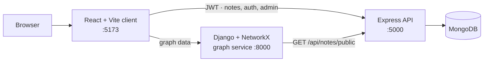

# NoteGraph

A note-sharing app for a college network. Students write short-lived notes, faculty publish permanent study notes, and a **knowledge graph** links the faculty notes by shared topics, so you can see how subjects connect.

> **Built for local use.** NoteGraph was designed to run on a college LAN / local server, not the public internet. The live link below is a **preview** running on demo data that resets regularly.

**Live preview:** https://notegraph-preview.vercel.app · **Demo login:** `testuser` / `testpass`

---

## What it does

| Feature | How it works |
|---|---|
| **Markdown notes** | Write in Markdown with code highlighting, math (KaTeX), tables and Mermaid diagrams. |
| **Notes that expire** | Student notes delete themselves after **48 hours**. In the last 2 hours a banner with a countdown lets the owner **renew** the note for another 48 hours. A background job removes expired notes every minute. |
| **Permanent notes** | Notes written by admins never expire. These form the shared knowledge base. |
| **Public / private + share links** | Public notes get a short link (`/notes/<slug>/<id>`) that anyone can open. Private notes are visible only to their owner. |
| **3 roles (RBAC)** | `user` writes their own notes · `admin` can view users, suspend them (for a time or permanently, with a reason) and delete any note · `superadmin` can also create users and change roles. |
| **Knowledge graph** | Every permanent public note is a node. Two notes are linked when they share a tag, and the more tags they share, the stronger the link. It's drawn as an interactive D3 force graph, with stats such as the most connected note and the top tags. |

---

## Architecture



| Part | Tech | Job |
|---|---|---|
| `client/` | React 19, Vite, React Router, D3, marked, KaTeX, Mermaid | The UI |
| `server/` | Node, Express 5, Mongoose, JWT, bcrypt, node-cron, helmet | Owns all the data: users, notes, roles, expiry |
| `django-graph/` | Django 6, Django REST Framework, NetworkX | A stateless compute service that builds the graph |
| Database | MongoDB | Users and notes |

**Why two backends?** Express owns the data and authentication. Django is a separate, stateless analytics service, because Python's NetworkX is the right tool for graph work. It has no database of its own. It reads public notes from Express over HTTP, so it can be scaled or replaced on its own. The cost is an extra network hop.

---

## Run it locally

**Requirements:** Node 20+, Python 3.12+, MongoDB running on `localhost:27017`.

### 1. Express API + demo data
```powershell
cd server
copy .env.example .env      # then set JWT_SECRET to any long random string
npm install
npm run seed                # creates 3 users and 25 notes (wipes existing users/notes)
npm run dev                 # http://localhost:5000/api/health
```

### 2. Django graph service
```powershell
cd django-graph
copy .env.example .env
python -m venv venv
venv\Scripts\activate
pip install -r requirements.txt
python manage.py migrate
python manage.py createsuperuser   # optional, for /admin
python manage.py runserver         # http://localhost:8000/api/graph/health/
```

### 3. React client
```powershell
cd client
copy .env.example .env
npm install
npm run dev                 # http://localhost:5173
```

### Demo accounts (created by `npm run seed`)

| Username | Password | Role | What to try |
|---|---|---|---|
| `testuser` | `testpass` | user | Dashboard with 5 notes, renew "Quick Exam Reminder" |
| `testadmin` | `testpass` | admin | Admin panel: users, suspend, delete notes |
| `testsuperadmin` | `testpass` | superadmin | Create users, change roles |

The seed creates **20 permanent admin notes** in 9 subject clusters (DSA, OS, DBMS, networks, Python, full-stack, TOC, discrete math, COA), which fill the graph. It also creates **5 notes for testuser** that expire normally. "Quick Exam Reminder" is set to expire in 90 minutes, so the renewal banner shows straight away.

---

## API overview

**Express**: `http://localhost:5000/api`

| Method | Endpoint | Access |
|---|---|---|
| POST | `/auth/register`, `/auth/login` | public |
| GET | `/auth/me` | logged in |
| GET | `/notes/public`, `/notes/public/:nanoid` | public |
| GET | `/notes/my` | logged in |
| POST · PUT · DELETE | `/notes`, `/notes/:id` | owner or admin |
| POST | `/notes/:id/renew` | owner, last 2 h before expiry |
| GET | `/admin/users`, `/admin/users/:id`, `/admin/users/:id/notes` | admin+ |
| POST | `/admin/users/:id/suspend`, `/unsuspend` | admin+ |
| DELETE | `/admin/notes/:id` | admin+ |
| POST | `/admin/users/create`, `/admin/users/:id/role` | superadmin |

**Django**: `http://localhost:8000/api/graph`

| Method | Endpoint | Returns |
|---|---|---|
| GET | `/` | `{ nodes, edges }` for D3 |
| GET | `/stats/` | node/edge count, most connected note, top 5 tags |
| GET | `/health/` | `{ "status": "ok" }` |

---

## Environment variables

| File | Variable | Purpose |
|---|---|---|
| `server/.env` | `MONGO_URI` | MongoDB connection string |
| | `JWT_SECRET`, `JWT_EXPIRES_IN` | Signing and lifetime of login tokens |
| | `CLIENT_URL` | Allowed CORS origin (the client URL) |
| `django-graph/.env` | `EXPRESS_API_URL` | Where Django reads public notes from |
| | `DJANGO_SECRET_KEY`, `DJANGO_DEBUG` | Django security settings |
| | `CORS_ALLOWED_ORIGINS`, `CSRF_TRUSTED_ORIGINS` | Comma-separated origins (production) |
| `client/.env` | `VITE_API_URL`, `VITE_GRAPH_API_URL` | Backend URLs, baked in at build time |

`.env` files are gitignored. Never commit real secrets.

---

## The live preview

The preview runs on free tiers: **MongoDB Atlas** (database), **Render** (Express and Django) and **Vercel** (client). Each service reads its settings from environment variables (table above), so no secrets live in the code.

Things to know about the preview:
- The demo logins are public and the data is reset from the seed, so don't store anything real.
- Free Render servers sleep after 15 minutes idle. The first request can take about 50 seconds to wake them.

---

## Known limits and next steps

- **Graph building is O(n²)**: every pair of notes is compared. For many notes, an inverted index (`tag → notes`) would compare only notes that share a tag.
- **Expiry uses a 60-second cron job.** A MongoDB TTL index on `expiresAt` would let the database delete expired notes by itself.
- **Django depends on Express being up.** If Express is down or asleep, the graph comes back empty instead of crashing.
- Planned: rate limiting on login, automated tests, Docker Compose for one-command local setup.
